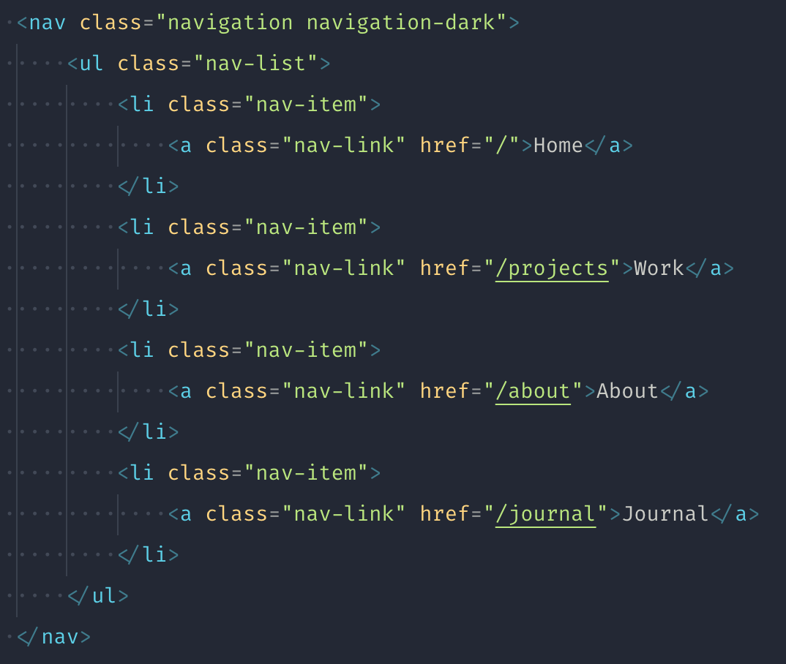

# Review Final

Muy buen trabajo! Veo mucha organización en tu código y el proyecto está muy bien resuelto. Además, veo que has optimizado muy bien las imágenes para que la carga sea rápida. Igualmente te paso feedback para que sigas mejorándolo.

En la home, el título de Contacto debería ser un `<h2>`. Actualmente lo tienes como párrafo, pero en este caso es más correcto que sea un titular.


La navegación podrías reaprovecharla. Ahora la tienes como dos elementos diferentes y no es recomendable repetir contenido por SEO y por mantenibilidad. Si nos fijamos en el código, ambas navegaciones son similares, y en el de móvil, podías haber obviado el uso de `<li>` para los separadores, utilizando `border-bottom` combinado con `padding`




Tú código HTML se reduciría a:

```html
<ul class="navigation">
    <li class="nav-item">
        <a class="nav-link" href="/">Home</a>
    </li>
    <li class="nav-item">
        <a class="nav-link" href="/projects">Work</a>
    </li>
    <li class="nav-item">
        <a class="nav-link" href="/about">About</a>
    </li>
    <li class="nav-item">
        <a class="nav-link" href="/journal">Journal</a>
    </li>
</ul>
```

Aunque en CSS tendrías que controlarlos por `@media` para darles los estilos correspondientes. En el caso de móvil tendría unos estilos para que se oculte y por Javascript le añades una clase que te permita mostrarlo. Tal como vimos en alguna sesión en clase.

Para la línea de separación, podrías utilizar el siguiente código:

```css
.nav-link {
    display: block;
    border-bottom: 1px solid currentColor;
    padding: 1rem 0;
    text-align: center;
}

.nav-link:last-child {
    border: 0;
}
```

En la página de proyectos estas utilizando botones de enlace a las páginas, pero no están funcionando muy bien porque son elementos `<button>` que envuelven `<a>``


Si bien es verdad que visualmente son "botones", en el HTML en realidad son links (enlaces) a otras páginas, por lo tanto lo solucionaría de la siguiente manera para cada uno de los botones:

```html
<a class="btns" href="/project1">
    <div class="btns-title">Weekly Dating Insider</div>
    <div class="btns-subtitle">Page Re-design</div>
</a>
```

Los estilos de la clase `btns` se las asignas al link, de esta manera se visualizará como botón, pero el link lo tendrá todo el elemento, ya que actualmente solo es clickable el título. Tendrás que añadir `display: block;` al botón para que puedas estilarlo como bloque.

Y en el caso del `btns-title` añadiría el estilo `text-transform: uppercase;` para que me estile el título como mayúsculas, pero en HTML se mantiene en minúsculas, para mejorar la accesibilidad.
